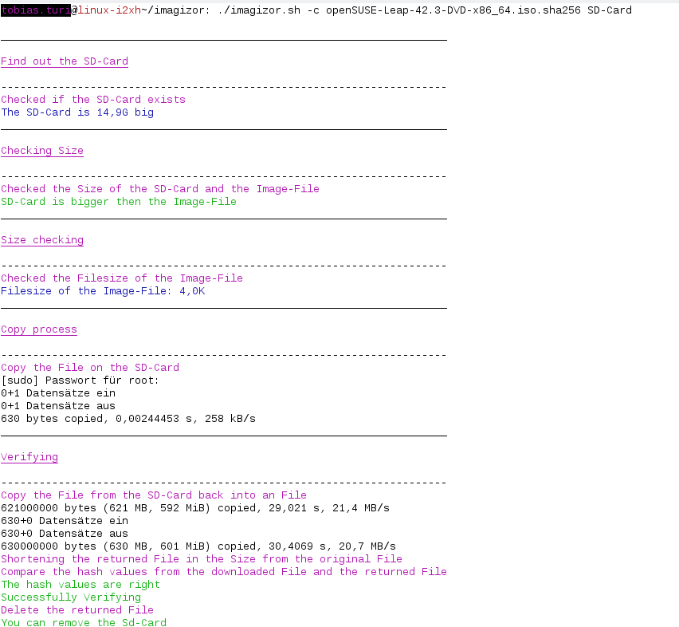
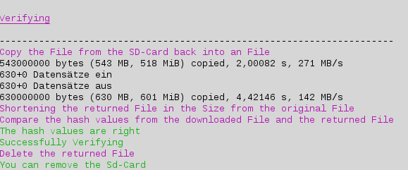
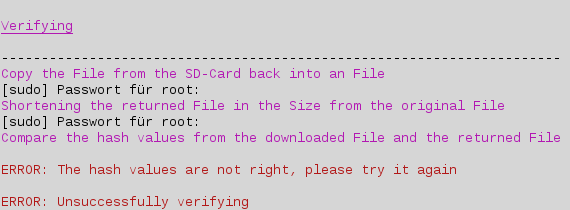

# imagizor
The Imagizor is a bash script, that download Software images and write the Images to an SD-Card or to an USB-Stick.
It can a cancels download resume, so can't a bad friend make a bad joke and cancel the download. 
This Script is the revolutionary Image writer script, it can even unpack a gz file without any help.
But the Script is in a !!Beta!! version, maybe it is not the revolutionary Image writer script, but in a while time i can say it is perfect (all data without guarantee).

You need a Formatter tool to get the maximum performance, for linux i use the shfmt foramtter you can download it here:https://github.com/mvdan/sh/releases/download/v2.0.0/shfmt_v2.0.0_linux_amd64

Now you can use the Script with the formatter to get the maximum power and when you have great ideas for the script, then you can work on it yourself.

But now the question how does the script work and how it looks in action?
For these question, i have prepare a example, that show you how the script works.

With ./imagizor.sh you call out the Script, -d is the first parameter he download the given link, the link is the second Parameter for my example is the Downloadlink: http://download.opensuse.org/distribution/leap/42.3/iso/openSUSE-Leap-42.3-DVD-x86_64.iso.sha256

Now the magic begins.

The script started to Download the File from the Link (Download file is the Image file), now you can pick a device (SD-Card or USB-Stick), the image file will copy to the device. 

The device muss have more memory then the Image file to guarantee this the script checked the filesize and the size of the device with each other.

But first the script checked, if the device inserted when a the device is not inserted the script wait until the device is inserted.

Now begins the copy progress, the scrip copy the Image File to the device.

To controll if the copy procress was sucessfull started a verifying progress, the Image file from the device copy back to an file that is called verify.img, then it's checked if the hashvalue from the verify image and from the image file are the same, when the values are the same the verifying was sucessfull 

and whent the hashvalues are different, the verifying was not sucessfull and you must try it again.

The script delete automatic the verify file, while after the script is finished the file is useless.

To make the script better, you can be involved and can work by yourself, while it is a open source project, to make this script to the revolutionary script our time.
