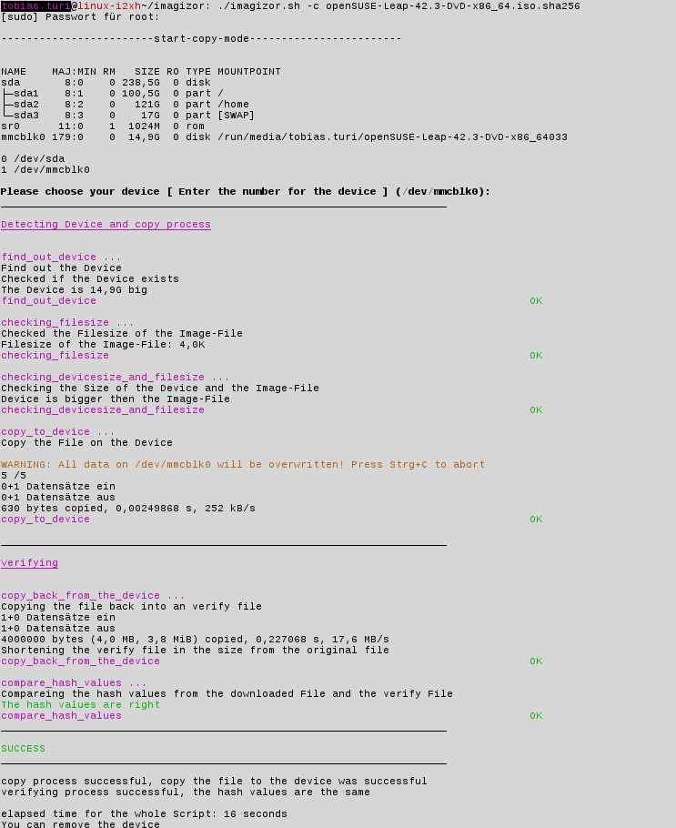
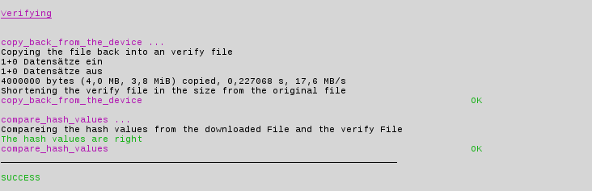
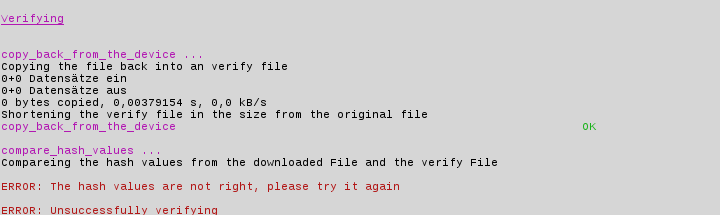

# imagizor
The Imagizor is a bash script, that downloads software images and writes the images to a SD-Card or to a USB-Stick.
It can a cancels download resume, so can't a bad friend make a bad joke and cancel the download. 
This Image writer script, is capable of handling .gz files.
This Script is an apprenticeship project, consider it "Beta".

You need a Formatter tool to get the maximum performance, for linux use shfmt formatter. You can download it here: https://github.com/mvdan/sh/releases/download/v2.0.0/shfmt_v2.0.0_linux_amd64

Now you can use the Script with the formatter to get the maximum power and when you have great ideas for the script, then you can work on it yourself.

But now the question how does the script work and how it looks in action?
For these question, i have prepare a example, that show you how the script works.

# Use

Use ./imagizor.sh to run the Script. -d specifies the source to download the file.

Now the magic begins.

Choose your favourite taget: SD-Card or USB-Stick.

The Script checks for target, then copy to device.

After copy operation, the verifying process starts. For that reason, the Script creates a Temporary file, now compare hashvalues

and when the hashvalues are different, verification failed. In this case the image writing process failed.

Temporary Files are removed after the Verification.

Feel free to improve the script even further.

# Rules

Use the shfmt formatter.

Don't use the tests.

Use the bash shell.
